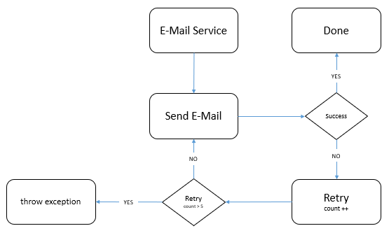

# Backend Coding Challenge: E-Mail Retry

## Beschreibung:

Dieses Spring-Boot-Projekt beinhaltet den relevanten Ausschnitt eines Microservices (Notification Service), der für den Versand von Benachrichtigungen über verschiedene Kommunikationskanäle (E-Mail, SMS, Push Notification) zuständig ist. Der `EmailController` stellt eine HTTP Schnittstelle zur Verfügung, über die sich eine neue Benachrichtigung per E-Mail versenden lässt.

In der aktuellen Ausbaustufe wird der E-Mail Versand bereits asynchron ausgeführt. Als Antwort auf den HTTP Request erhält der Benutzer der Schnittstelle somit unmittelbar einen Status `200 OK` und die E-Mail wird dem Empfänger daraufhin *irgendwann* zugestellt. Tritt während der Zustellung ein Fehler auf (z. B. der SMTP Server hat eine Störung und antwortet nicht) wird der Benutzer **nicht** informiert und die Benachrichtigung wird **nicht** übermittelt. 

In den letzten Wochen sind vermehrt Beschwerden über nicht zugestellt E-Mails beim Support Team eingegangen. Die Ursache ließ sich auf temporäre Ausfälle des SMTP Servers zurückführen.

Als neuer Entwickler im Notification Team erhältst du deshalb die Aufgabe einen Retry-Mechanismus für den E-Mail Versand zu implementieren. So soll sichergestellt werden, dass die Nachrichten zukünftig auch im Falle einer kurzzeitigen Störung des SMTP Servers erfolgreich an den Empfänger übermittelt werden.

## Akzeptanzkriterien

1. Pro E-Mail Benachrichtigung muss es genau 5 Versuche für die Zustellung geben. Der erste Versuch muss nach 5 Sekunden erfolgen und darauffolgende Retrys müssen in exponentiellem Abstand voneinander ausgeführt werden.
2. Startet der Notification Service neu, während einem oder mehreren aktiven Retry-Prozessen, müssen die Retrys nach dem Neustart der Anwendung an der Stelle fortgesetzt werden an der diese unterbrochen wurden (z. B.: 2 Retrys erfolgreich ausgeführt → Crash Notification Service → Neustart Notification Service → Ausführung der verbleibenden 3 Retrys).
3. Der implementierte Retry-Mechanismus muss für ein hochverfügbares Setup des Notification Service (d. h. mit mehreren parallel ausgeführten Instanzen) entwickelt werden. Beachte diesen Umstand bei deinen Architekturentscheidungen.

## Rahmenbedingungen:

- Im Hauptverzeichnis des Projekts liegt eine `docker-compose.yml`. Mit dem Befehl `docker-compose up` lässt sich die benötigte Infrastruktur für die Challenge in Docker starten. 
Dabei werden folgende Dienste bereitgestellt:
    - MongoDB (NoSQL Datenbank): `[http://localhost:27017](http://localhost:27017)`
    - Mailhog (Mail Server Mock): `[http://localhost:1025](http://localhost:1025)` (SMTP Server), `[http://localhost:8025](http://localhost:8025)` (Web UI - Inbox)

    Zur erfolgreichen Fertigstellung der Challenge dürfen ausschließlich die aufgelisteten Dienste verwendet werden. Die Verwendung dieser Dienste ist nicht verpflichtend, aber es dürfen keine zusätzlichen Anwendungen eingesetzt werden.

- Die Struktur des vorliegenden Microservices folgt der Hexagonalen-Architektur (aka. Clean Architecture - [https://blog.cleancoder.com/uncle-bob/2012/08/13/the-clean-architecture.html](https://blog.cleancoder.com/uncle-bob/2012/08/13/the-clean-architecture.html)). Halte dich bei deiner Implementierung an die bestehende Anwendungsarchitektur.
- Standardmäßig ist der Mail Server Mock (Mailhog) so konfiguriert, dass nur 50% der E-Mails erfolgreich verarbeitet werden. Dieses Verhalten lässt sich über die `docker-compose.yml` anpassen oder komplett deaktivieren.
- Für diese Coding Challenge haben wir `3` Tage eingeplant. Bitte richte dich bei deiner Umsetzung nach diesem Richtwert und reiche dein (Teil-)Ergebnis nach Ablauf dieser Arbeitszeit ein.
- Solltest du während der Bearbeitung Zeichnungen oder Notizen anfertigen, reiche diese zusammen mit deiner Lösungen ein.

## Bonus Aufgaben:

1. Schreibe Unit- und Integrationstests für deinen implementierten Retry-Mechanismus.

## Lösungsansatz

